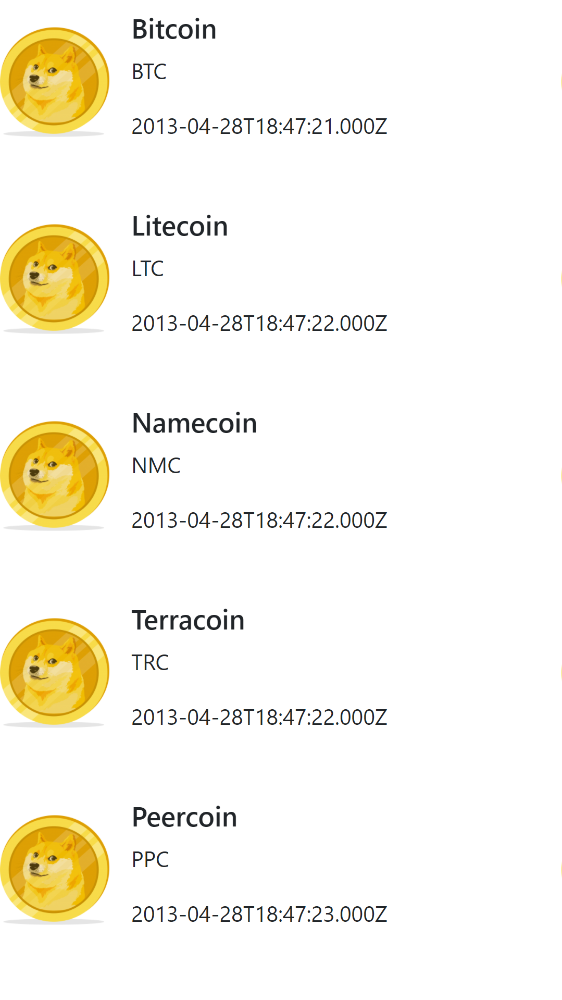

# API de Criptomoedas
Usando API Coin Market Cap para exibir dados de criptomoedas.

Para testar a versão ao vivo, [clique aqui.](https://cursos-e-estudos.github.io/front-criptomoedas-API/)
 

---

 

<b> Visual mobile </b>

  

---
 

 [@SouVitorGabriel](https://github.com/souvitorgabriel) Projetos pessoais podem ser vistos no meu perfil.

 

 [@SouVitorGabriel](https://github.com/cursos-e-estudos) Outros estudos podem ser vistos aqui nessa organização.